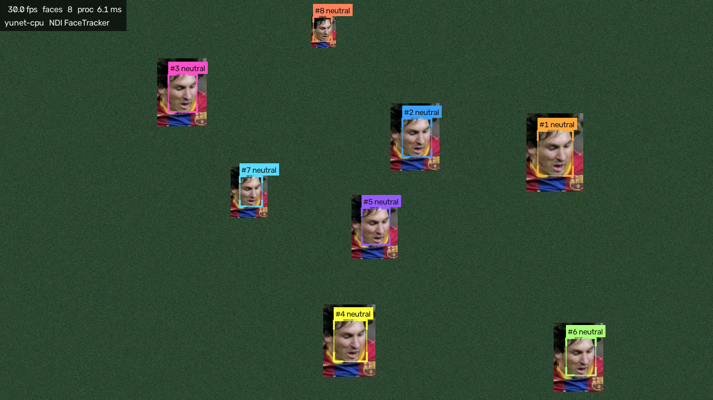

# facetrack — live face tracking to NDI

Points a camera at a crowd, finds and follows faces, and sends the result
over **NDI** to your vision mixer — with a browser control panel for
everything. Built for live events.

**What it does / doesn't do:** face *detection and tracking* only — boxes,
stable numbers, optional expression labels. It does **not** identify
people and stores nothing.



---

## Quick start

### Get it onto the machine

Either clone with git:

```bash
git clone https://github.com/legofsalmon/facetrack.git
```

…or on GitHub click **Code → Download ZIP** and unzip it anywhere.
To update later: `git pull` (or re-download), then run Setup again.

### Run it

- **Mac** — double-click **`Facetrack.app`** (drag it to your Dock for
  one-click starts). It opens Terminal running the launcher.
- **Windows** — double-click **`Facetrack Windows.bat`**, or run
  **`Create Desktop Icon.bat`** once to get a proper desktop icon.

One launcher does everything:

- **First launch** sets itself up — installs components, downloads the
  model files, runs a self-check (a few minutes; on Mac, if macOS blocks
  the file, right-click → Open). Click **Allow** on the camera prompt.
- **Every launch after that** starts in seconds.
- **After an update** (`git pull` / re-download) it notices and re-runs
  just the setup steps that are needed.

**Nothing to pre-install on either platform.** If no suitable Python is
found, the launcher downloads `uv` (official installer, into your user
folder, no admin password) which fetches a self-contained Python — 3.12
on Mac, 3.13 on Windows. First run needs internet.

The **control panel opens in your browser** automatically. Your mixer will
see NDI sources named like `MAC (FaceTracker)` — the panel shows the exact
names. That's it.

### The control panel

- Reachable from **any phone/laptop/tablet on the same network** — the
  terminal window shows the address (e.g. `http://192.168.1.20:8089`).
- **Presets** across the top: *Wide crowd*, *Mid crowd*, *Stage close-up*,
  *Power saver*. Start with one of these; fine-tune below if needed.
- **Video source** lists every connected camera by name (webcams, capture
  cards, virtual cameras) and every NDI feed on the network — switching is
  instant, no restart. Plug in a device and hit the ↻ rescan button; the
  camera currently in use is shown as "(in use)" and left undisturbed.
- Every change applies live **and is remembered for next launch**.
- **Everything you can change while running is in the panel**, grouped
  into collapsible cards — Input, Face finding, On-screen look, Outputs,
  Cutout shape, plus Performance and Machine load. Collapse the ones a
  given show doesn't need; the panel remembers per browser. The only
  launch-time settings left are the ones that cannot change safely
  mid-run: the panel's own port/host, the NDI feed names (renaming drops
  receivers) and the PIN.
- **Detector** is a panel choice: *Auto* (CenterFace on an NVIDIA GPU,
  YuNet elsewhere), *Fast — YuNet* or *Accurate — CenterFace*. The hint shows
  which engine is actually running. Picking one that can't load falls
  back to YuNet with a panel message rather than stopping the show.
- **The preview is switchable** — tabs under the image show *Camera +
  graphics*, *Clean camera*, *Overlay only*, *Faces cutout* or *Mask*,
  so you can check exactly what each feed carries; transparency shows
  as a checkerboard.
- **Previews** (the panel thumbnail and the window on the facetrack
  machine) can be switched off during the show to save processing — the
  NDI/Syphon/Spout feeds keep running. With *Keep program clean* on and
  previews off, the annotation pass is skipped entirely.
- **Process card**: *Pause* keeps the feeds up with a STANDBY slate (the
  overlay feed goes fully transparent, so keyed graphics vanish cleanly);
  *Restart* relaunches the app in place with saved settings and the panel
  reconnects itself; *Quit* shuts down — start again with the launcher on
  the machine (the panel reconnects automatically when you do).
- **If the input dies mid-show** (unplugged camera, dead NDI feed) the
  outputs cut to plain black — graceful on a live screen — while the
  panel preview shows a NO SIGNAL slate and the header a red pill.
  facetrack reconnects automatically the moment the source returns.
- **Number badges / expressions** draw in a per-person colour palette, or
  flip on **Brand colour** to draw every box in one colour that matches
  the event's look.
- **Click the preview** to open it full-size in its own tab; the *view
  log* link in the Process card shows the app's recent log lines from
  any device — no need to walk to the machine.
- **Performance card + load chip**: the header shows total pipeline
  **load** as a percentage of the frame budget, and the Performance card
  breaks it down per feature (face finding, expressions, silhouette
  model, feed outputs, previews…) with live bars — so you can see
  exactly what each toggle costs and what to switch off when the
  machine is tight. fps and load chips turn amber/red as they approach
  limits.
- **PIN protection**: on a shared production network, launch with
  `--pin 4721` (or add `"pin": "4721"` to `settings.json`). The panel then
  asks once per browser; without it, controls, preview and source listing
  are locked. No PIN set = open panel (fine at home).
- If the input dies or is missing, the app keeps running and shows a
  NO INPUT slate — fix the source from the panel.

### If something's wrong

- **It crashed?** The launcher restarts it automatically after 3 seconds
  (clean quits don't restart). A watchdog also force-restarts the app if
  the pipeline wedges for 30 seconds (stalled driver, blocked I/O).
  Everything the app printed is also in `logs/facetrack.log` for
  after-the-fact diagnosis — or the *view log* link in the panel.
- **The machine can't sleep** while facetrack runs (caffeinate on macOS,
  the equivalent power override on Windows) — no dead feed because a
  screensaver kicked in.
- **It's wedged?** Delete the `.venv` folder and double-click the
  Facetrack file again — it rebuilds everything. Or, from a terminal:

```bash
.venv/bin/python main.py --doctor
```

It checks Python, packages, models, camera, NDI, Syphon/Spout and the
panel port, and prints the fix for anything broken.

---

## Technical reference

### Pipeline

| Stage | Implementation | Notes |
|---|---|---|
| Capture | OpenCV (camera/capture card/file) or NDI in | threaded, latest-frame-wins for low latency |
| Detection | YuNet (OpenCV, CPU) or CenterFace (ONNX Runtime, GPU-friendly) | auto-selected per machine, or pick one in the panel |
| Tracking | SORT-style IoU + velocity tracker | stable IDs, sub-ms for hundreds of faces |
| Expression | FER+ (8 classes), budgeted round-robin | cost stays flat as crowd grows |
| Output | NDI via cyndilib (+ local preview window) | NDI runtime bundled |
| Control | FastAPI + WebSocket panel on :8089 | settings persist in `settings.json` |

### Machine notes

- **macOS (testing)**: YuNet on CPU — ~4-5 ms detection at 640 px on an
  M2 Max; 100+ fps at 720p.
- **Windows + NVIDIA (production, RTX 5080)**: `requirements.txt` installs
  `onnxruntime-gpu`, so the **CenterFace** detector and the matting
  models run on CUDA/TensorRT. CenterFace is fully convolutional, so
  raising *Search detail* to 960/1280 costs little on the GPU and is
  where it pulls ahead of YuNet on distant faces. First TensorRT run
  compiles an engine (can take a minute).

### Output feeds

The panel's **Outputs card is a matrix**: four content types, each
switchable onto NDI (network) and/or Syphon/Spout (same machine) with
identical controls — no more transport-specific options:

| Content | What it carries | Notes |
|---|---|---|
| Program | the picture (annotated, or clean with *Keep program clean* on) | panel shows connected-receiver count per NDI feed |
| Overlay | graphics only, real alpha (premultiplied) | key it in vMix / Resolume / TriCaster / OBS+DistroAV |
| Faces cutout | the picture only inside the cutout mask, transparent elsewhere | *Cutout shape*: rectangles, soft ovals, or a people silhouette; *Silhouette model* picks the engine — **Fast** (PP-HumanSeg), **Quality** (MODNet) or **Best** (RVM video matting); *Cutout margin* (face shapes) and *Silhouette margin* (people: grow for room, shrink to trim the background fringe matting models leave on hair and shoulders), plus edge softness and steadiness |
| Mask | the cutout's matte itself | *Mask style*: **White on black** (classic luma matte for external keying) or **White on alpha** (alpha-aware chains) |

NDI feeds are named `<name>`, `<name> Overlay`, `<name> Faces`,
`<name> Mask`; texture feeds appear as `facetrack`,
`facetrack-overlay/-faces/-mask` (with a custom `--ndi-name`, the base
becomes `facetrack-<name>`, so two instances never collide).

Feed *names* are fixed at launch because renaming mid-show would drop
receivers. NDI's codec is lossy, so keyed NDI graphics gain a pixel of
soft fringe — normal for all NDI alpha sources; the Syphon/Spout path is
uncompressed and keys perfectly. Feeds are emitted together; your mixer's
frame sync aligns them.

**Syphon/Spout notes:** the texture share appears as `facetrack` (or
`facetrack-<name>` with a custom `--ndi-name`, so two instances never
collide) in
Resolume / VDMX / MadMapper / TouchDesigner on the same machine. *What
it carries* switches it between the full picture, the graphics-with-alpha
layer, and the faces cutout — VJ keying with no network hop. Python version matters: Syphon needs Python 3.12,
Spout ≤ 3.13 — the Setup scripts pick a compatible Python automatically
(on macOS they prefer a uv-managed 3.12; Homebrew's python@3.12 bottle is
currently broken on macOS 26.1).

### CLI flags

Everything in the panel is also a flag (`python main.py --help`). Flags
override saved settings for that run. Non-panel flags:

| Flag | Purpose |
|---|---|
| `--source` | camera index / file / URL / `ndi:<name>` |
| `--width --height --fps` | capture request (default 1280x720@30) |
| `--backend yunet\|scrfd` | force a detector |
| `--ndi-name` / `--ndi-overlay` / `--no-ndi` | feed naming |
| `--out-width` | downscale the NDI send |
| `--no-web` / `--web-host` / `--web-port` / `--no-browser` | panel control |
| `--no-preview` | no local window (headless/rack use) |
| `--doctor` | self-check and exit |

### Layout

```
main.py                  entry point: flags, saved settings, banner
facetrack/
  capture.py             camera / file / NDI-in / NO-INPUT slate, camera probe
  detectors.py           YuNet + CenterFace backends, live-tunable
  tracker.py             SORT-style multi-face tracker
  emotion.py             FER+ expression estimation (budgeted)
  overlay.py             boxes/labels/stats + alpha overlay rendering
  ndi_io.py              NDI output + NDI input (cyndilib)
  pipeline.py            the frame loop, hot source-swap, stats, preview JPEGs
  params.py              validated live parameters
  settings.py            auto-persistence (settings.json)
  webui.py               FastAPI app: panel, WebSocket, MJPEG, /sources
  static/index.html      the control panel
  doctor.py              self-check (python -m facetrack.doctor)
models/                  ONNX models (doctor --fix re-downloads)
```

### Running two instances (e.g. two cameras)

Each instance needs its own panel port and NDI name:

```bash
python main.py --source 0 --ndi-name "FaceTracker A" --web-port 8089
python main.py --source 1 --ndi-name "FaceTracker B" --web-port 8090
```

Settings are shared per folder — for fully independent settings, keep a
second clone of the repo. Launching a second instance *without* those
flags doesn't start a duplicate: it just opens the existing panel.

### Privacy

facetrack detects and follows faces; it performs no identity recognition,
no matching against any database, and records nothing — frames are
processed and discarded in memory. Expression labels are a cosmetic
overlay estimate. For public events, follow your usual venue practice on
camera signage, and keep this paragraph handy for client conversations.

### Licensing (product builds)

The repo build is **unrestricted** — no keys, no trial, nothing to
activate. Licensing only switches on when a build is packaged with a
vendor public key; see `docs/DISTRIBUTION.md` for issuing keys and
building a licensed app. In such a build, an unlicensed copy runs for 72
hours and then holds its feeds on a TRIAL ENDED slate until a key is
entered in the panel's Licence card. Keys are Ed25519-signed and verify
offline, so activation works on an air-gapped show machine.

### Model licences

Everything shipped is permissively licensed (MIT / Apache-2.0) and can be
distributed in a commercial product — see `models/README.md` for the
per-model table.

Two deliberate exceptions:

- **RVM** (the *Best* matting model) is **GPL-3.0**. Distributing it
  would force the whole product under GPL with a source requirement, so
  packaged builds exclude it; it stays available for in-house use. See
  `facetrack/edition.py`.
- **SCRFD** was removed entirely — InsightFace licenses its trained
  models for non-commercial research only. **CenterFace** (MIT) replaced
  it as the GPU detector.

If you redistribute, also review the NDI SDK terms for the bundled NDI
runtime.

### Keeping the machine healthy

facetrack is compute-hungry by nature — on a 12-core Mac the heaviest
setup (RVM silhouette + expressions + several feeds) draws about 4.5
cores. Two guards in the panel's **Machine load** card keep that from
swamping a machine (both are switched on by the *Power saver* preset):

- **Limit CPU use** — by default the AI runtimes take every core they
  can. This caps them to about a third of the cores (measured: 448% ->
  347% CPU on a 12-core Mac for the same frame rate), which keeps the
  rest of the machine — and this control panel — responsive. Most
  effective on Windows, where OpenCV honours the cap too; on macOS the
  OpenCV wheel uses GCD and ignores thread limits, so only the ONNX
  models (MODNet, CenterFace — the expensive ones) are capped.
- **Auto relief** (on by default) — if the pipeline can't hold the frame
  budget for 5 seconds it sheds quality in three steps: silhouette
  updated less often, then face finding every other frame, then the
  detector size capped. It restores itself step by step once there's
  headroom, and the panel says what it's doing. Your own settings are
  never rewritten — relief is an internal override.

facetrack also never runs faster than the source supplies: a 30 fps
camera caps the loop at 30 fps, a 50 fps one at 50.

### Capture cards (Blackmagic, Magewell, Elgato, AVerMedia, AJA)

Two panel controls matter here, both in the **Input** card: **Capture
format** (capture cards often refuse "auto" — ask for the exact signal,
e.g. 1080p50) and **Capture driver** (on Windows, vendor cards live
behind **DirectShow**). Re-applying the same source reconnects with the
new settings.

| Card | How it appears | Notes |
|---|---|---|
| Elgato Cam Link / HD60, Magewell USB Capture, AVerMedia USB, AJA U-TAP | standard webcam (UVC) | works everywhere, any driver setting |
| Blackmagic DeckLink / UltraStudio | Windows: DirectShow device via Desktop Video ("Blackmagic WDM Capture") | install Blackmagic Desktop Video; set Capture driver = DirectShow; set the exact Capture format. No macOS path — use NDI or a UVC converter there |
| Magewell Pro Capture (PCIe) | Windows DirectShow/WDM | driver = DirectShow; excellent auto-format |
| AVerMedia PCIe | Windows DirectShow | driver = DirectShow |
| AJA KONA | Windows DirectShow filters via AJA software | driver = DirectShow; U-TAP models are plain UVC |

If a card shows black: confirm the signal format matches Capture format,
try the other Windows driver, and check the vendor utility sees signal.

### ST 2110 / Blackmagic IP10 (status)

Native software ST 2110 needs PTP-timed NICs and a vendor stack (NVIDIA
Rivermax + ConnectX, or Intel's DPDK-based MTL) — a systems project, not
a patch, so facetrack does not speak 2110 directly. The production-grade
routes that work today:

- **2110 in**: a **DeckLink IP** card presents 2110 flows as a normal
  DeckLink capture device → works via the DirectShow path above. Or a
  2110→NDI gateway (Magewell Pro Convert, BirdDog) feeds facetrack's
  NDI input.
- **2110 / IP10 out**: Blackmagic's **IP10** codec exists only inside
  their hardware (no public SDK), so "output IP10" = put a Blackmagic
  2110 IP converter or NDI→2110 gateway on facetrack's output. NDI out
  → gateway is the normal pattern for graphics/utility sources in 2110
  plants; the gateway owns PTP timing.
- A native DeckLink SDK playout module (SDI/2110 out from the app) is
  feasible engineering but milestone-sized — ask when it's needed.

### Start on boot (show machines)

- **macOS**: System Settings → General → Login Items → add
  `Facetrack.app` from the project folder.
- **Windows**: run `Create Desktop Icon.bat` once, press Win+R, type
  `shell:startup`, Enter, and copy the desktop's Facetrack shortcut into
  the folder that opens.

The machine then boots straight into facetrack: the launcher self-heals,
the watchdog and crash-restart keep it alive, and the panel reconnects
from any browser.

### Known quirks

- The installed NDI HX driver makes OpenCV's ffmpeg print an `objc`
  duplicate-class warning at startup on this Mac. Harmless.
- The panel has no authentication — it's meant for a closed production
  LAN. Use `--web-host 127.0.0.1` to keep it local-only.
- macOS camera permission belongs to the *terminal app* that launches
  facetrack; grant it once when prompted.
